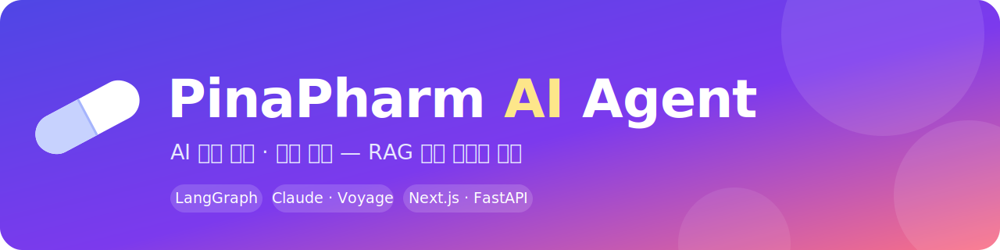
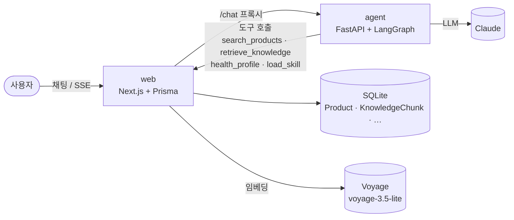

<div align="center">



<h1>PinaPharm AI Agent</h1>

<strong>약사 지식 기반 AI 상담 + 영양제 추천 — RAG로 답변에 근거를 더하다</strong>

<br/><br/>


<br/>


<br/><br/>


</div>

---

## ✨ 소개

일반인이 웹 채팅으로 약사 지식 기반 상담을 받고, 약사가 어드민에서 등록한 영양제를 상담 결과에 맞춰 추천·구매하는 시스템입니다. 답변은 **검색된 근거(식약처 원료 인정정보·취급 제품)에 그라운딩**되어 단순 생성보다 정확하고 안전합니다.

```text
pinapharm-ai/
├── web/      Next.js 16  : 채팅 UI · 약사 어드민 · 영양제 CRUD · Prisma/SQLite (데이터 단일 소스)
├── agent/    FastAPI      : 약사 에이전트 (LangGraph tool-use 루프, Python 3.13)
└── docs/     설계 스펙 · 구현 플랜 · 로드맵
```

> **에이전트는 DB를 직접 만지지 않습니다.** 모든 데이터 접근은 web 내부 API(`/api/agent-tools/*`, `/api/agent-config`)를 HTTP로 호출합니다.

## 🧩 주요 기능

- 💬 **상담 채팅** — SSE 스트리밍, 세션 메모리(`session_id`)로 대화 맥락 유지
- 🧠 **RAG** — 제품 **하이브리드·구조화 검색**(의미 + 제형·용량·성분·알레르기 제외) + **지식 문서 청킹 그라운딩**(출처 인용)
- 🧑‍⚕️ **개인화** — 연령대·기저질환·복용약·알레르기·임신/수유 등 건강 프로필을 기억해 추천·주의사항에 반영
- 🚨 **안전 가드레일** — 발열·흉통·호흡곤란 등 응급 신호를 triage로 분류해 즉시 병원 권유
- 🛒 **장바구니·결제·주문** — 서버 영속 장바구니 → 배송지 → **토스페이먼츠 결제**(테스트) → 주문 `paid`. 트랜잭션 **재고 차감·오버셀 방지**, 서버측 금액 신뢰, 취소 시 **PG 환불**·재고 복원, 웹훅 서명검증
- 🔒 **한국 PII 레닥션** — 이메일·주민번호·전화번호를 LLM 전송 전 마스킹
- 🗂️ **약사 어드민** — 상품(검색·정렬·페이징·모달·일괄)·에이전트 설정·상담 스킬·**지식 베이스** 탭 관리
- 🛟 **편집 안전망 & 테스트** — 설정·스킬·문서 **버전 관리·diff·롤백**, 마크다운 프리뷰, 스킬 **매칭 미리보기·LLM 드라이런**

## 🏗️ 아키텍처



상담 그래프: `triage`(응급 분류) → `agent ⇄ tools` 루프 → `finalize`, 위험 시 `emergency` 분기. 설정(프롬프트·페르소나·스킬)은 web DB에 저장하고 에이전트가 요청마다(30s TTL 캐시) 가져옵니다.

## 🚀 빠른 시작

사전 준비: **Node 20+ / npm**, **Python 3.11+**(개발은 3.13), **Anthropic API 키**(실제 상담 응답), 선택적으로 **Voyage API 키**(RAG 의미검색·그라운딩).

### Makefile (간편)

처음 한 번만 `make setup`(의존성 설치) 후 두 서버를 한 번에 관리합니다.

```bash
make start     # web(:3000) + agent(:8000) 백그라운드 실행
make stop      # 두 서버 중지
make restart   # 재시작
make status    # 실행 상태 확인
make logs      # 로그 실시간 보기
```

### 수동 실행

```bash
# 1) web (포트 3000)
cd web
cp -n .env.example .env            # DATABASE_URL, AGENT_URL, (선택) VOYAGE_API_KEY
npm install
npx prisma migrate dev             # SQLite 스키마 생성
npm run seed                       # 약사 1명 + 샘플 영양제 5종
npm run dev                        # http://localhost:3000

# 2) agent (포트 8000)
cd agent
python3.13 -m venv .venv && . .venv/bin/activate
pip install -e ".[dev]"
cp -n .env.example .env             # ANTHROPIC_API_KEY 를 실제 값으로
uvicorn app.main:app --reload --port 8000
```

> `ANTHROPIC_API_KEY`가 없으면 채팅은 "상담 처리 중 오류" 메시지로 우아하게 실패합니다(배선은 정상).

## 🔎 RAG 색인 (선택)

의미검색·원료 그라운딩을 켜려면 `web/.env`에 Voyage 키(`VOYAGE_API_KEY` 또는 `VOYAGE_TOKEN`)를 넣고 색인합니다.

```bash
cd web
npm run index:knowledge   # data/ingredient-knowledge.json → 원료 지식 임베딩
npm run index:products    # 활성 제품 → 의미검색 임베딩
```

> 키가 없거나 임베딩이 실패해도 **lexical 검색으로 폴백**되어 상담은 계속됩니다. Voyage 무료 티어는 RPM 제한이 있어 대량 색인 시 결제수단 등록이 필요할 수 있습니다.

## 📦 실제 영양제 데이터 넣기

1. **어드민 단건 등록** — `/admin`의 "새 영양제 등록" 모달
2. **CSV 일괄 등록** — `/admin`의 "CSV 일괄 등록"(샘플 CSV 다운로드 제공). 헤더: `name, brand, price, stock, ingredients, conditionTags, description` (`conditionTags`는 셀 안에서 `;` 구분)
3. **식약처 공공 API import** — 건강기능식품 품목제조신고(C003) OpenAPI에서 실제 제품 적재

```bash
# 무료 인증키: https://www.foodsafetykorea.go.kr/api/openApiInfo.do?svc_no=C003
cd web && echo 'MFDS_API_KEY="발급키"' >> .env
npm run import:mfds -- 100            # 100건 적재 (가격 0·비활성으로 들어옴)
```

> import된 제품은 **가격 0·비활성**으로 들어오며, 약사가 `/admin`에서 가격·재고를 정하고 "진열 활성화"하면 노출됩니다.

## 🧪 테스트

```bash
cd web && npm test                            # 도메인/CRUD/RAG 테스트 (vitest, 45)
cd agent && . .venv/bin/activate && pytest     # 도구/그래프/에이전트 루프 (28)
```

> 상담 안전·행동 회귀 평가: `make eval`(실제 그래프 — `ANTHROPIC_API_KEY` + web(:3000) 필요). 응급 분기·도구 호출·추천 유무를 결정적으로 검증하고, 안전 시나리오 실패 시 비정상 종료합니다.

## 🗺️ 로드맵

구현 현황과 향후 계획은 [docs/ROADMAP.md](docs/ROADMAP.md)를 참고하세요. RAG 설계·구현 기록: [spec](docs/superpowers/specs/2026-06-16-rag-consultation-design.md) · [plan](docs/superpowers/plans/2026-06-16-rag-consultation.md).

## 🔬 프로토타입 범위 (의도된 단순화)

- 어드민 인증 없음 · **결제는 토스페이먼츠 테스트 키** — 실 결제는 실 키 교체 시 운영(테스트 카드로 검증)
- RAG 원료 코퍼스는 약사 검수 시드(확장 예정) · 다단계 추론(플래너)은 구현, 멀티에이전트는 보류

<div align="center"><sub>Made with 💊 for 피나팜 맑은 약국</sub></div>
